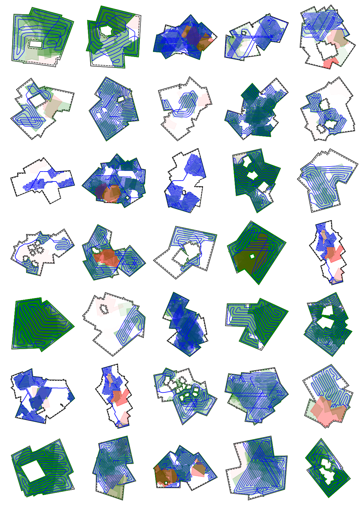

# ALENEX 2024: Near-Optimal Coverage Path Planning with Turn Costs (Code and Data)

*Dominik Krupke, 2023, TU Braunschweig, Germany*

**Abstract:**

>  Coverage path planning is a fundamental challenge in robotics, with diverse applications in aerial surveillance, manufacturing, cleaning, inspection, agriculture, and more.
>  The main objective is to devise a trajectory for an agent that efficiently covers a given area,
>  while minimizing time or energy consumption.
>  Existing practical approaches often lack a solid theoretical foundation, relying on purely heuristic methods,
>  or overly abstracting the problem to a simple Traveling Salesman Problem in Grid Graphs.
>  Moreover, the considered cost functions only rarely consider turn cost, prize-collecting variants for uneven cover demand, or arbitrary geometric regions.
>
>  In this paper, we describe an array of systematic methods for handling arbitrary meshes derived from intricate, polygonal environments.
>  This adaptation paves the way to compute efficient coverage paths with a robust theoretical foundation for real-world robotic applications.
>  Through comprehensive evaluations, we demonstrate that the algorithm also exhibits low optimality gaps, while efficiently handling complex environments. 
>  Furthermore, we showcase its versatility in handling partial coverage and accommodating heterogeneous passage costs, offering the flexibility to trade off coverage quality and time efficiency.

**Full Version:** [https://arxiv.org/abs/2310.20340](https://arxiv.org/abs/2310.20340)



## Algorithm Overview:

Our adapted algorithm extends the work of Fekete and Krupke to handle polygonal instances with regions of varying costs. Below is a simplified explanation of the algorithm.

### Steps of the Generalized Algorithm

1. **Polygon to Graph Transformation**: We start by translating the polygonal instances into a discrete graph composed of waypoints, laying the groundwork for computational handling.

2. **Fractional Solution via Linear Programming**: On this graph, we calculate a fractional solution that guides the subsequent stages, employing linear programming techniques.

3. **Atomic Strip Selection**: Utilizing the fractional solution, we identify atomic strips, which are the building blocks for our solution. This process is more intricate for general meshes compared to uniform square grids.

4. **Cycle Cover Matching**: We then match these atomic strips to form a cycle cover, ensuring all waypoints are included in our preliminary solution.

5. **Cycle Cover Enhancement**: The cycle cover is further refined to improve its quality and efficiency.

6. **Tour Construction**: By connecting the cycles, we construct a single tour that covers all waypoints.

7. **Tour Refinement**: Finally, the tour undergoes further improvements to optimize its performance.

### Adaptations from the Original Algorithm

The key steps where our algorithm diverges from Fekete and Krupke's original are the conversion of polygons to graphs (Step 1), the selection of atomic strips (Step 3), and the improvements made to both the cycle cover and final tour (Steps 5 and 7). These modifications enable our algorithm to effectively handle more complex and irregular environments.

When applied to a regular square grid and with certain optimizations turned off, our algorithm's performance closely aligns with the original. Detailed explanations of the enhanced steps can be found in the subsequent sections of our documentation.


You can find a more detailed problem description in the
[polgyon_instance module](src/pcpptc/polygon_instance/__init__.py).

See [this example](./examples/example_algorithm_steps.ipynb) to get an
impression of the individual steps.

## Installation

> :warning: **The code in this repository does not allow to reproduce the smooth
> meshes unless you have by chance older versions of *dmsh* and *optimesh* installed.
> The open source versions of these package have unfortunately been removed from GitHub
> and PyPI and been replaced by commercial packages. More below.**

We are using the Gurobi solver. You can get a free academic license on their
website. If you do not have a license installed, you can probably not run any
non-trivial instances. During the installation, the Python-package will
automatically be installed. If you need to set up a license, we recommend
installing Gurobi via conda, as this will also install the necessary tools for
license management.

You can build and install this package via cloning the repository and running

```bash
pip install .
```

This should automatically install all further dependencies. The code still has
some legacy parts for which no package will be installed, but you should not
need them.

### More on the problem with dmsh and optimesh

The project used *dmsh* and *optimesh* as fundamental elements to create
good meshes. While *dmsh* can be replaced easily with only little loss,
*optimesh* is very important for smoothing the grids. Both modules have
been open source projects (MIT/GPL3) while we were developing the tools,
but now have changed to a commercial license that requires a subscription
of 50Euro per year for two workstations. I can understand that a developer
wants to monetize a great product, but it is very unfortunate that they
completely removed the old versions from GitHub and from PyPI. Thus, the
old virtual environments can no longer be installed.

There are citable, archived versions still under open source license of both modules on zenodo (like arxiv for code by CERN):

* [https://zenodo.org/record/5019221](https://zenodo.org/record/5019221)
* [https://zenodo.org/record/4728056](https://zenodo.org/record/4728056)

However, the dependency meshplex is not. Versions of it are available as Debian-archives,
but Unfortunately not in the right version.
We still have the right version on our workstations, but only the raw code with a license file,
but no attribution etc.
We guess that we can make the old open source versions fit together somehow,
and add them to this package, just so it remains usable, but we first have to
check the conditions under which we are allowed to do so.

## Experiments

The full experiments have a size of around 1GB even when compressed, thus, they
may be missing in the repository.

- [./experiments/01_grid](./experiments/01_grid) provides a number of
  experiments regarding the grid.
- [./experiments/02_algorithm_explanation](./experiments/02_algorithm_explanation)
  provides visualizations and examples of the individual steps.
- [./experiments/03_grids_in_detail](./experiments/03_grids_in%20_detail)
  provides additional experiments for the grid.
- [./experiments/05_partial_coverage](./experiments/05_partial_coverage)
  provides experiments for partial coverage.
- [./experiments/06_optimizations](./experiments/06_optimizations) provides
  experiments regarding optimizations.
- [./experiments/rotation_experiments](./experiments/rotation_experiments)
  provides experiments regarding the optimal orientation of the grid.

Most of the corresponding jupyter notebooks that evaluate the experiments
contain a documentation and explanation.

## Notes

This project was developed from 2020-2022 as a (pretty large) side project, and
updated end of 2023 to make it ready for publication as some dependencies became
incompatible or were no longer available. It has a huge code base, as it took
many iterations to finally get satisfying results. A lot of the failed ideas
have been removed, but some are still (partially) contained. Equally, while some
parts of the code are reasonably clean (especially the difficult ones that
required evaluation), others are not.
